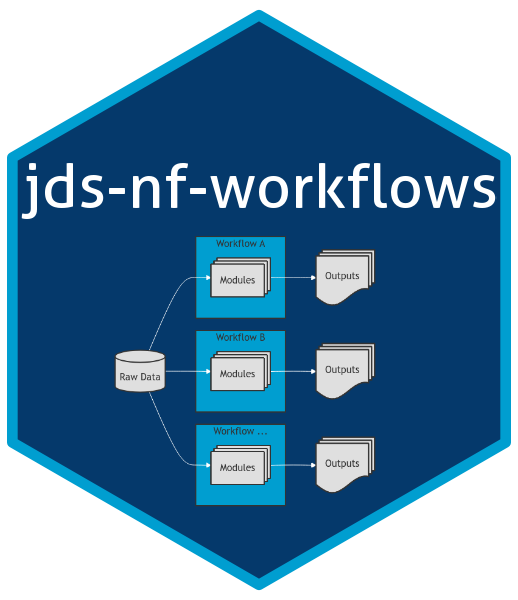

# JAX Data Science Nextflow DSL2 Workflows

This repository contains production bioinformatic analysis workflows.

## Pipeline Level Documentation, Quick Start, and Developer Documentation: 

Please see the [Wiki documentation](https://github.com/TheJacksonLaboratory/jds-nf-workflows/wiki) associated with this repository for all documentation.